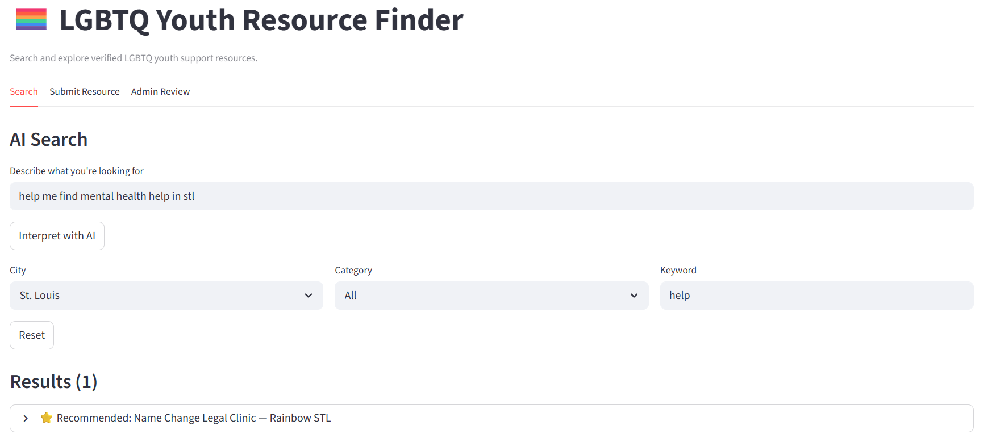
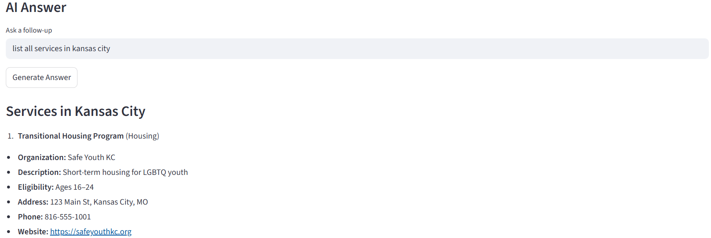
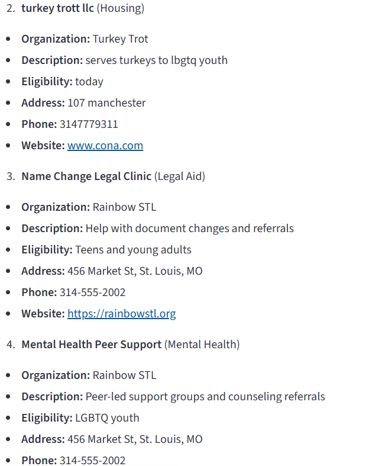
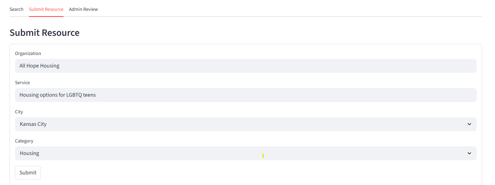
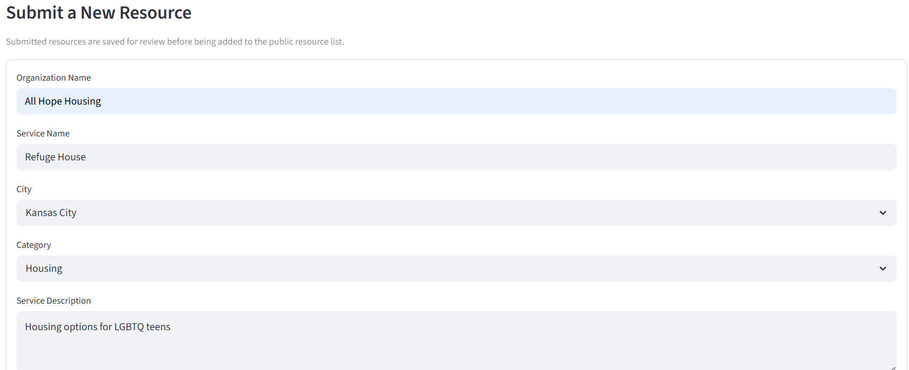
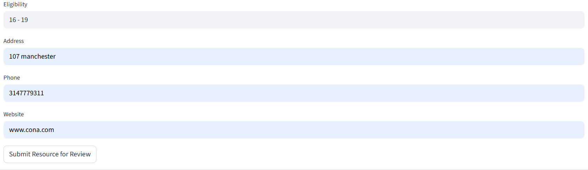
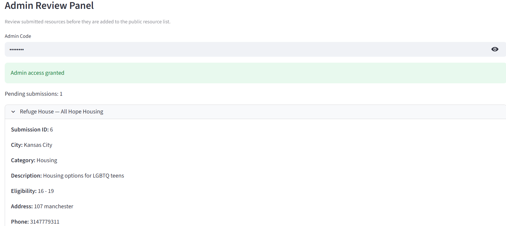

# 🏳️‍🌈 NLP Resource Finder v2 (AI-Powered)

## Project Background

This project is the second iteration of the NLP Resource Finder, designed to solve accessibility challenges in locating critical support services for LGBTQ youth.

The application helps users discover housing, mental health, legal, and crisis support services across Midwest cities using natural language search and AI-assisted guidance.

From a data perspective, this system simulates a real-world environment where:

- Users search using natural language  
- Data is stored and queried from a relational database  
- New data is submitted and reviewed before being added  
- AI enhances both input interpretation and output understanding  

---

## 📸 App Preview

### 🔍 Search + AI Results
Users can search naturally using phrases like:

> “housing help for LGBTQ youth in St. Louis”

The AI interpretation layer converts natural language into structured database filters before querying the database.



---

### 🤖 AI Answer Layer

After retrieving results, users can ask contextual follow-up questions.  
The AI answer layer generates guidance using only the retrieved database records.

#### AI Answer — Part 1


#### AI Answer — Part 2


---

### 📝 Submit Resource Workflow

Users can submit new resources for review before they are added to the live dataset.

#### Submission Form — Main View


#### Submission Form — Extended View


#### Submission Form — Additional Fields


---

### 🛠️ Admin Review Panel

Administrators can review pending submissions, approve valid resources, reject bad entries, and control what enters the production dataset.

#### Admin Panel — Queue Overview


#### Admin Panel — Review Actions


---

## 💼 Business Problem

Accessing critical support services—such as housing, mental health care, and legal assistance—can be difficult for LGBTQ youth due to fragmented information, inconsistent resource directories, and barriers in navigating complex systems.

Traditional resource databases rely on rigid keyword searches and static listings, making it difficult for users to quickly find relevant services tailored to their needs.

Organizations managing these resources also face challenges in:

- Maintaining accurate and up-to-date data  
- Allowing user contributions without compromising data quality  
- Ensuring consistent categorization across services  

---

## 🎯 Solution

This project addresses these challenges by building an AI-assisted resource discovery system that:

- Translates natural language into structured database queries  
- Enables faster and more intuitive access to relevant services  
- Provides AI-generated guidance based on available data  
- Introduces a controlled submission and approval pipeline to maintain data integrity  

---

## 🚀 Key Features

- 🔍 AI-powered search (natural language → structured query)
- 📊 Filter-based browsing (city, category, keyword)
- 🤖 AI-generated guidance (context-aware answers)
- 📝 User submission system for new resources
- 🛠️ Admin review panel (approve/reject workflow)
- 🚫 Duplicate prevention system
- ⭐ Recommended result highlighting

---

## 🧠 System Architecture

```text
User Input
   ↓
AI Interpretation (Layer 1)
   ↓
SQL Query (Database)
   ↓
Results
   ↓
AI Answer Layer (Layer 2)

User Submission
   ↓
Pending Table
   ↓
Admin Review
   ↓
Approved → Live Database
```

🗂️ Data Structure & System Design
The application uses a relational database consisting of:


organizations → provider-level data


services → individual services tied to organizations


cities → geographic mapping


categories → service classification


submitted_resources → pending user submissions


📊 Executive Summary
This project demonstrates how AI can be integrated with structured data systems to improve accessibility and usability of information.
Key takeaways:


AI reduces friction in search by translating natural language into structured queries


Combining AI with a relational database enables both precision and flexibility


A controlled review pipeline ensures data integrity while allowing user contributions


The system simulates real-world backend workflows including ingestion, validation, and retrieval


🔍 Insights Deep Dive
1. AI Interpretation Layer


Converts unstructured input into usable database filters


Handles ambiguity better than keyword-only systems


Improves accessibility for non-technical users


2. Query & Retrieval System


SQL-based filtering ensures accurate results


Supports multi-parameter queries


Provides consistent, explainable outputs


3. AI Answer Layer


Uses only retrieved data (reduces hallucination risk)


Transforms raw results into actionable guidance


Acts as a decision-support layer


4. Data Governance Pipeline


Prevents duplicate entries


Separates public vs pending data


Introduces admin-controlled approval


💡 Recommendations
Based on this system, future improvements could include:


Implementing a smarter relevance ranking algorithm


Adding urgency detection (e.g., crisis vs general support)


Migrating to a cloud database (PostgreSQL / Supabase)


Introducing authentication (admin vs public users)


Deploying the application for public access


⚠️ Assumptions and Caveats


The dataset is limited and does not represent a complete real-world directory


AI responses are restricted to available database results


No real-time API integrations are included


Admin authentication is simplified for demonstration


🧰 Tech Stack


Python


Streamlit


SQLite


OpenAI API


Pandas


⚙️ Setup Instructions
Install dependencies:
pip install -r requirements.txt
Create a .env file:
OPENAI_API_KEY=your_api_key_here
Run the app:
streamlit run app.py

📌 Notes


The database file is excluded from version control


AI responses are based only on available resource data


This project demonstrates full-stack + AI system design principles


🚀 Future Enhancements


Cloud deployment (Streamlit Cloud)


Real-time data ingestion


Advanced ranking / recommendation engine


Expanded geographic coverage


👤 Author
Built as part of a hands-on project exploring AI + data systems and real-world application design.
